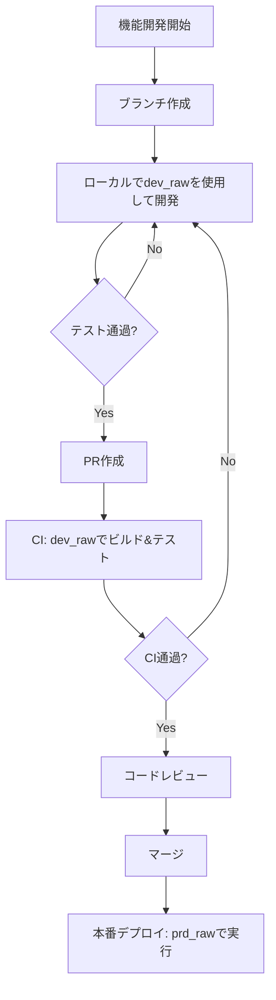

# ローカル環境ワークフロー サンプル（DuckDB完結型）

BigQueryのprd/dev環境切り替えフローをDuckDBでローカル完結で模倣するサンプルです。
本番BigQueryに接続せずに、開発フローの学習・検証ができます。

## 概要

### アーキテクチャ

```
┌─────────────────────────────────────────────────────────────────┐
│                     DuckDB (sample.duckdb)                      │
├─────────────────────────────────────────────────────────────────┤
│                                                                  │
│  ┌──────────────┐              ┌──────────────┐                 │
│  │   prd_raw    │              │   dev_raw    │                 │
│  │  (本番RAW)   │              │  (開発RAW)   │                 │
│  └──────┬───────┘              └──────┬───────┘                 │
│         │                              │                         │
│         │ target=prd                   │ target=dev/ci           │
│         │                              │                         │
│         ▼                              ▼                         │
│  ┌──────────────┐              ┌──────────────┐                 │
│  │  prd_staging │              │  dev_sandbox │                 │
│  │  prd_marts   │              │  ci_{run_id} │                 │
│  │   (本番)     │              │   (開発)     │                 │
│  └──────────────┘              └──────────────┘                 │
│                                                                  │
└─────────────────────────────────────────────────────────────────┘
```

### BigQuery環境との対応

| このサンプル | BigQuery環境 | 用途 |
|-------------|-------------|------|
| `dev_raw` | `ss-analytics-data-hub.dev_raw` | 開発用RAWデータ |
| `prd_raw` | `ss-analytics-data-hub.prd_raw` | 本番RAWデータ |
| `dev_sandbox` | `ss-analytics-data-hub.dev_sandbox` | ローカル開発出力先 |
| `ci_{run_id}` | `ss-analytics-data-hub.ci_{run_id}` | CI一時スキーマ |
| `prd_staging` | `ss-analytics-data-hub.staging` | 本番staging |
| `prd_marts` | `ss-analytics-data-hub.marts` | 本番marts |

## クイックスタート

### 1. 環境準備

```bash
# プロジェクトルートから依存関係をインストール（初回のみ）
cd /path/to/dbt_development_analysis
uv sync

# このディレクトリに移動
cd samples/local_env_workflow

# ローカル環境のセットアップ（dev_raw/prd_rawスキーマ作成）
uv run python scripts/setup_local_env.py
```

### 2. 開発モードで実行（dev_rawを参照）

```bash
# seedsをロード
uv run dbt seed --target dev

# モデルをビルド
uv run dbt run --target dev

# テストを実行
uv run dbt test --target dev

# または build で一括実行
uv run dbt build --target dev
```

### 3. 本番モードで実行（prd_rawを参照）

```bash
# 本番モードでビルド
uv run dbt build --target prd
```

### 4. CIモードで実行（PR CI想定）

```bash
# CIモードでビルド（一時スキーマに出力）
export GITHUB_RUN_ID=12345
uv run dbt build --target ci

# CIスキーマの削除
uv run dbt run-operation drop_schema --args '{"schema_name": "ci_12345"}' --target ci
```

## ディレクトリ構成

```
samples/local_env_workflow/
├── README.md                      # このファイル
├── dbt_project.yml                # dbtプロジェクト設定
├── profiles.yml                   # 接続設定（dev/ci/prd）
├── sample.duckdb                  # DuckDBファイル（自動生成）
├── models/
│   ├── staging/
│   │   ├── _sources.yml           # ソース定義（環境切り替え対応）
│   │   ├── _staging.yml           # モデル定義
│   │   ├── stg_customers.sql      # 顧客staging
│   │   └── stg_orders.sql         # 注文staging
│   └── marts/
│       ├── _marts.yml             # モデル定義
│       ├── mrt_customer_orders.sql # 顧客別注文サマリー
│       └── mrt_daily_orders.sql    # 日別注文サマリー
├── macros/
│   ├── get_raw_schema.sql         # RAWスキーマ取得マクロ
│   ├── drop_schema.sql            # スキーマ削除マクロ
│   └── generate_schema_name.sql   # スキーマ名生成マクロ
├── seeds/
│   ├── raw_customers.csv          # 顧客サンプルデータ
│   └── raw_orders.csv             # 注文サンプルデータ
├── scripts/
│   └── setup_local_env.py         # 環境セットアップスクリプト
└── .github/
    └── workflows/
        └── dbt-pr-ci.yml          # GitHub Actions CI設定
```

## ターゲット別の動作

| ターゲット | RAW層 | 出力先 | 用途 |
|-----------|-------|--------|------|
| `dev` | dev_raw | dev_sandbox_* | ローカル開発 |
| `ci` | dev_raw | ci_{run_id}_* | PR CI検証 |
| `prd` | prd_raw | staging, marts | 本番想定 |
| `prd_marts` | prd_raw | prd_marts | 本番marts |

## 環境切り替えの仕組み

### sources.yml（RAW層の切り替え）

```yaml
sources:
  - name: raw
    # ターゲットに応じてスキーマを切り替え
    schema: "{{ 'dev_raw' if target.name in ['dev', 'ci'] else 'prd_raw' }}"
```

### generate_schema_name.sql（出力スキーマの制御）

```sql

    
        {# 本番: カスタムスキーマ名をそのまま使用 #}
        {{ custom_schema_name | trim }}
    
        {# 開発/CI: ターゲットスキーマ + カスタムスキーマ #}
        {{ target.schema }}_{{ custom_schema_name | trim }}
    

```

## GitHub Actions CI

PRが作成されると自動的にCIが実行されます:

1. DuckDB環境のセットアップ
2. `dbt seed` でseedsデータをロード
3. `dbt build --target ci` でビルド＆テスト
4. `dbt docs generate` でドキュメント生成
5. CIスキーマの削除

## 開発フロー



## コマンドリファレンス

### 環境セットアップ

```bash
# 初回セットアップ（dev_raw/prd_rawスキーマ作成）
uv run python scripts/setup_local_env.py

# スキーマ情報の確認
uv run python scripts/setup_local_env.py info
```

### dbtコマンド

```bash
# seedsのロード
uv run dbt seed --target dev

# モデルのビルド
uv run dbt run --target dev

# 特定モデルのみ
uv run dbt run --target dev --select stg_customers

# テスト実行
uv run dbt test --target dev

# ビルド＆テスト一括
uv run dbt build --target dev

# ドキュメント生成
uv run dbt docs generate --target dev

# ドキュメント表示
uv run dbt docs serve --target dev

# SQLのコンパイル確認（実行なし）
uv run dbt compile --target dev --select stg_customers

# CIスキーマ削除
uv run dbt run-operation drop_schema --args '{"schema_name": "ci_local_test"}' --target ci
```

## DuckDBへの接続方法

### Python (duckdb パッケージ)

```bash
# インストール
pip install duckdb
# または
uv add duckdb
```

```python
import duckdb

# 接続
conn = duckdb.connect('sample.duckdb')

# クエリ実行
result = conn.execute("SELECT * FROM dev_raw.raw_customers LIMIT 10").fetchall()
print(result)

# DataFrameとして取得
df = conn.execute("SELECT * FROM dev_raw.raw_customers").df()

# スキーマ一覧
schemas = conn.execute("SELECT schema_name FROM information_schema.schemata").fetchall()

# テーブル一覧
tables = conn.execute("""
    SELECT table_schema, table_name
    FROM information_schema.tables
    WHERE table_schema NOT IN ('information_schema', 'pg_catalog')
""").fetchall()

conn.close()
```

### DuckDB CLI

```bash
# インストール (macOS)
brew install duckdb

# 接続
duckdb sample.duckdb

# CLI内でのコマンド
.tables              # テーブル一覧
.schema              # スキーマ表示
.mode markdown       # 出力形式変更
SELECT * FROM dev_raw.raw_customers;
.quit                # 終了
```

### VSCode拡張機能

1. **DuckDB Shell** 拡張機能をインストール
2. `Cmd+Shift+P` → `DuckDB: Open Database`
3. `sample.duckdb` を選択

### DataGrip / JetBrains IDE

1. Database Tool Window → `+` → Data Source → DuckDB
2. File: `sample.duckdb` のパスを指定
3. Test Connection → OK

### Jupyter Notebook

```python
%pip install duckdb jupysql

%load_ext sql
%sql duckdb:///sample.duckdb

%%sql
SELECT * FROM dev_raw.raw_customers LIMIT 5
```

## 個人GitHub Actionsとの連携

ローカル環境を個人のGitHub Actionsと連携させる方法です。

### 方法1: 個人リポジトリへプッシュ（推奨）

```bash
# 1. GitHub上で個人用リポジトリを作成
# 例: your-username/dbt-local-workflow

# 2. ローカルをGit初期化してプッシュ
cd samples/local_env_workflow
git init
git add .
git commit -m "Initial commit"
git remote add origin https://github.com/your-username/dbt-local-workflow.git
git push -u origin main

# 3. PRを作成するとCIが自動実行
```

### 方法2: gh CLIで手動トリガー

既存のワークフローは`workflow_dispatch`に対応しています：

```bash
# gh CLIのインストール
brew install gh

# GitHub認証
gh auth login

# ワークフローを手動実行
gh workflow run dbt-pr-ci.yml --ref main

# ターゲットを指定して実行
gh workflow run dbt-pr-ci.yml --ref main -f target=dev

# 実行状況を確認
gh run list --workflow=dbt-pr-ci.yml
gh run watch  # リアルタイムで監視
```

### 方法3: actでローカル実行（GitHub不要）

GitHub Actionsをローカルで実行できるツール：

```bash
# actのインストール
brew install act

# ワークフローをローカルで実行
act -W .github/workflows/dbt-pr-ci.yml

# 特定のイベントをシミュレート
act workflow_dispatch -W .github/workflows/dbt-pr-ci.yml

# 詳細ログ
act -v -W .github/workflows/dbt-pr-ci.yml
```

### 方法の比較

| 方法 | メリット | デメリット |
|------|---------|-----------|
| 個人リポジトリ | 本番と同じ環境、PR連携可能 | GitHubアカウント必要 |
| gh CLI | 既存ワークフロー活用、簡単 | リポジトリ必要 |
| act | GitHub不要、完全ローカル | Docker必要、完全互換ではない |

## BigQuery環境への移行

このサンプルをBigQuery環境に移行する場合:

1. `profiles.yml` のtypeを `bigquery` に変更
2. 認証設定を追加（oauth / service_account）
3. `project` と `dataset` を実際のBigQuery設定に変更

```yaml
# BigQuery版 profiles.yml（例）
smc_data_hub:
  target: dev
  outputs:
    dev:
      type: bigquery
      method: oauth
      project: ss-analytics-data-hub
      dataset: dev_sandbox
      location: asia-northeast1
      threads: 1
```

## 関連ドキュメント

- [dev_raw検証開発フロー設計書](../../docs/dev_raw_workflow.md)
- [BigQuery版サンプル](../dev_raw_workflow/)
- [dbt Documentation](https://docs.getdbt.com/)
